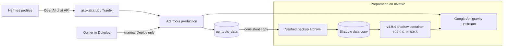

# Design: AG Tools → Claude 5.5

## 1. Overview

Миграция заменяет устаревший кастомный runtime image на неизменяемый upstream v4.9.4, не меняя публичный endpoint `https://ai.okak.club/v1` и production volume до ручного owner Deploy. Совместимость доказывается отдельным shadow-контейнером на копии production data. После ручного deployment Hermes-профили с существующим provider `okak` получают шесть aliases и обновлённый live catalog.

Код upstream и код старого ChatGPT/Codex-форка не сливаются: production переходит на чистый upstream image.

## 2. Architecture

### 2.1 Current and target flow



### 2.2 Trust and mutation boundaries

```mermaid
sequenceDiagram
    participant A as Agent
    participant L as Live v4.5.1
    participant B as Backup/Shadow copy
    participant S as Shadow v4.9.4
    participant O as Owner
    participant D as Dokploy
    participant H as Hermes profiles

    A->>L: Read baseline; keep running
    A->>B: Create and verify backup/copy
    A->>S: Start pinned digest on loopback
    A->>S: Catalog + single/multi-turn smoke
    A->>S: Restart and re-verify data
    A-->>O: Candidate evidence + exact Deploy steps
    O->>D: Manual image update + Deploy
    D->>L: Replace production task
    O-->>A: Confirm completion
    A->>L: Post-deploy read-back and smoke
    A->>H: Add aliases only to profiles with existing OKAK
    A->>H: Refresh/read back catalog and alias resolution
```

The agent never performs the `O -> D` operation.

## 3. Components and interfaces

### 3.1 Production AG Tools

**Current:** Swarm service `sidequests-agtools-a1xtnr`, custom v4.5.1 image, volume `ag_tools_data`.

**Target:** Same service/domain/volume, image:

```text
docker.io/lbjlaq/antigravity-manager:v4.9.4@sha256:eef6a4d326d420429b3a31b9f3cc1a990fcc462704afd9aa2d58d74224cf1e47
```

No application-code build is required. No `latest` tag is accepted for production.

### 3.2 Backup artifact

A timestamped root-only directory/archive on `nlvmv2` contains the pre-migration data tree. Verification is structural and secret-safe:

- archive test succeeds;
- expected index/config/database/account paths exist;
- `accounts.json` parses;
- each account file parses;
- counts/states are printed, never credentials or emails.

The backup remains until post-deploy QA is complete.

### 3.3 Shadow runtime

A disposable Docker container runs the target digest with:

- a dedicated cloned volume, never `ag_tools_data`;
- bind `127.0.0.1:18045:8045` (or another verified-free loopback port);
- no Traefik labels and no Dokploy ownership;
- no auto-restart;
- the copied `gui_config.json`, so existing proxy/admin behavior is exercised;
- bounded direct Google upstream calls for real capability proof.

Before testing, `docker inspect` must prove the container mount source is the shadow volume and the published address is loopback.

### 3.4 API contracts

#### Health

```http
GET /health
```

Expected candidate response:

```json
{"status":"ok","version":"4.9.4"}
```

#### Model discovery

```http
GET /v1/models
Authorization: Bearer <profile-owned OKAK key>
```

The response `data[].id` set must include exactly one of each approved Claude 5.5 ID. Keys are read from their existing secret location and never printed.

#### Bounded generation

```http
POST /v1/chat/completions
Authorization: Bearer <existing key>
Content-Type: application/json
```

Single-turn payload:

```json
{
  "model": "<approved-id>",
  "messages": [{"role":"user","content":"Reply exactly: OK"}],
  "max_tokens": 8,
  "stream": false
}
```

Multi-turn proof resends the first assistant output plus a second minimal user message. It checks HTTP status, non-empty assistant content and absence of signature errors; it does not print hidden reasoning or account data.

### 3.5 Hermes profile configurator

Profiles are discovered from the default Hermes home and `~/.hermes/profiles/*`. A profile qualifies only when parsed `config.yaml` already contains `providers.okak` with the expected `https://ai.okak.club/v1` endpoint.

For each qualifying profile:

```yaml
model_aliases:
  okak-claude-sonnet-5-5-low:
    model: claude-sonnet-5-5-low
    provider: okak
  # ... five more exact mappings
```

Changes use `hermes config set` with the corresponding profile, not direct YAML rewriting. Before/after snapshots compare:

- qualifying profile set;
- current default model/provider;
- six alias mappings;
- absence of provider creation in unqualified profiles.

Aliases and provider cache are activated only after owner deployment makes the backend catalog live. Before the gate, the agent prepares inventory and exact commands but does not expose aliases that point at the old backend.

## 4. Data model compatibility

### 4.1 Existing data

```text
/root/.antigravity_tools/
  accounts.json
  accounts/<id>.json
  gui_config.json
  token_stats.db
  proxy_logs.db
  security.db
  user_tokens.db
  logs/
```

The old fork added optional `provider`/OpenAI fields and a `provider` statistics column. Rust Serde ignores unknown fields unless `deny_unknown_fields` is explicitly set; upstream v4.9.4 account/config structs do not set that attribute. SQLite tolerates additional columns. These source observations are hypotheses until the shadow runtime reads and restarts the copied data successfully.

### 4.2 Preservation invariant

```text
before.accounts.count == after.accounts.count == 3
before.disabled == after.disabled == 0
before.proxy_disabled == after.proxy_disabled == 0
provider_set == {google}
```

No account identifiers or emails appear in evidence.

## 5. Deployment and rollback

### 5.1 Owner deployment

After all pre-deploy tasks pass, the owner changes only the Docker image field in Dokploy to the pinned v4.9.4 reference and clicks Deploy. Volume, domain, port and environment settings remain unchanged.

### 5.2 Post-deploy verification order

1. Swarm image digest and replicas.
2. Container status/restart count.
3. `/health` version.
4. Account invariants.
5. `/v1/models` six-ID set.
6. Gemini regression smoke.
7. Six bounded Claude single-turn smokes.
8. Sonnet-high and Opus-high second-turn smokes.
9. Hermes alias/cache activation and read-back.

### 5.3 Rollback

If runtime/data/model checks fail:

1. Owner restores `ghcr.io/mint1524/ag-tools:sha-0066e12` in Dokploy and deploys.
2. If the live data was incompatibly mutated, restore from the pre-deploy backup before accepting rollback.
3. Verify v4.5.1 health, account invariants and Gemini smoke.
4. Do not install, or remove, new aliases until their target models are live again.

## 6. Error handling

| Failure | Classification | Response |
|---|---|---|
| Registry digest mismatch | Supply-chain blocker | Stop; do not run candidate |
| Backup/archive check fails | Data-safety blocker | Stop before shadow/deploy |
| Shadow mounts live volume | Isolation blocker | Stop/remove disposable container, correct mount |
| Account count/state changes | Compatibility blocker | Stop; preserve evidence; no deploy |
| Claude ID missing | Catalog blocker | No deploy |
| 403/404 on 5.5 | Entitlement/capability blocker | Report model family/tier only; no deploy |
| Second turn `thinking.signature` failure | Upstream regression | No deploy; do not downgrade to v4.9.1 |
| Gemini regression | Backward-compatibility blocker | No deploy |
| Dokploy MCP log API 500 | Observability degradation | Use bounded SSH/docker read-only checks; not a pass by itself |
| Hermes profile lacks OKAK | Not in scope | Leave unchanged |
| Post-deploy verification fails | Production failure | Initiate owner rollback instructions |

## 7. Test strategy

### 7.1 Static/source evidence

- Confirm v4.9.4 tag and Docker digest.
- Confirm official model catalog contains six IDs.
- Confirm v4.9.4 includes the Claude 5.5 signature fixes and v4.6.3+ JSON self-healing lineage.
- Confirm old/custom data fields are not guarded by `deny_unknown_fields`.

### 7.2 Shadow integration tests

- Backup extraction and JSON parse.
- First and second candidate startup.
- Account invariant checks after both startups.
- Loopback/mount isolation inspection.
- Model catalog exact-set check.
- Gemini smoke.
- Six single-turn Claude smokes.
- Two multi-turn Claude smokes.

### 7.3 Profile tests

- Machine-readable profile inventory.
- Before/after default comparison.
- Exact six-alias mapping per qualified profile.
- Negative assertion for profiles without OKAK.
- Live provider catalog refresh and resolution after deployment.

### 7.4 Independent review

A read-only reviewer receives the spec, command evidence and changed config paths, with explicit bans on production deploy, secret access/output and mutating the shared tree. All findings are reproduced against current state before closure.

## 8. Decisions and rejected alternatives

### Decision D-1 — clean upstream v4.9.4

**Chosen:** clean upstream image.

**Rejected:** preserve/rebase custom ChatGPT provider. It is unused (no ChatGPT accounts) and overlaps 23 files changed upstream across 504 commits.

**Rejected:** minimal 5.5 backport to v4.5.1. The old tree predates the current official catalog and the complete multi-turn signature fixes.

### Decision D-2 — six explicit IDs

**Chosen:** expose low/medium/high for both Sonnet and Opus, matching upstream’s actual IDs.

**Rejected:** only friendly base aliases, because they hide effort/tier choice and are not the IDs returned by current upstream.

### Decision D-3 — manual owner deploy

**Chosen:** owner updates Dokploy after evidence review.

**Rejected:** agent deployment through Dokploy API, because production deployment is an explicit owner-only boundary.

### Decision D-4 — aliases after backend deployment

**Chosen:** inventory and prepare aliases before the gate; activate them after the backend serves the six IDs.

**Rejected:** install aliases before deploy, because they would advertise models that the current v4.5.1 backend rejects.

## 9. Implementation correction — 2026-10-05

Shadow probing refined the model-discovery design:

- `official_models.json` proves that v4.9.4 knows how to map the six public Claude 5.5 IDs, but it does **not** grant account entitlement.
- Runtime `/v1/models` combines static supported models with advanced models derived from the live accounts’ cached quota `model_limits`; the advanced set is capability-filtered across enabled accounts.
- `POST /api/accounts/refresh` is the shadow-side refresh seam. After a real refresh, all three copied PRO accounts still expose 29 quota models and no Claude 5.5 entry, so candidate `/v1/models` contains approved 0/6.
- Direct Sonnet 5.5 probing reaches both production and sandbox upstream endpoints and receives HTTP 404 for every account; AG Tools maps the exhausted/limited result to client HTTP 503.

Therefore the immutable source catalog is necessary supply-chain evidence, while **live quota catalog 6/6 plus successful requests** is the deployment gate. A static alias or model-list override would only hide the missing entitlement and is explicitly rejected.
